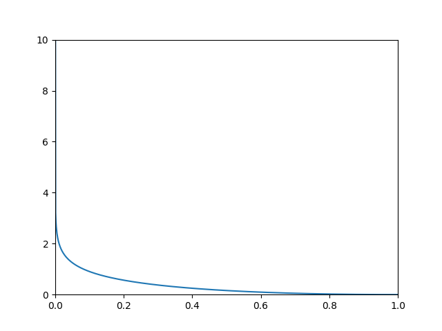

# Pursuit Curve
Plot pursuit curve in specific cases.
 
Math proof is given below
 

## Problem 
For example, we have a chicken that can only run in a straight line.
 
Also, we have a bit clever fox, that always pursuit that poor chicken and not like its victim can run in a curve.
 
Lets imagine they both start at the same-y-coord position but with different x coords. Chicken path is OY axis and found fox's shortest path to chicken is our goal.
 

## Math Moment...
To do so we need to find tangent 
